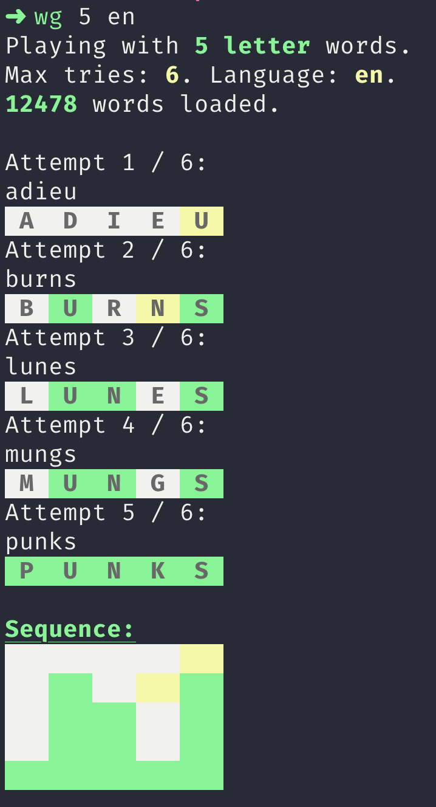
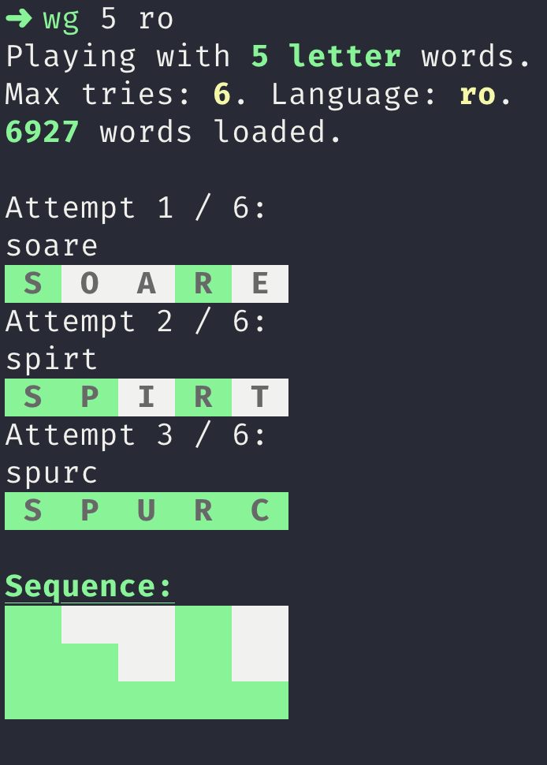

# Words
`Words` is a set of command line games based on word guessing. Best way to spend those minutes within the CLI while your builds are running ;).  

Each game has multiple dictionaries and word lengths. With `Words` you will also learn new words. Everytime you fail to guess the selected word, you will get its short definition as well as a link to more detailed explanations.

<p  align="center">
  
   
</p>

# Use
Download the native binary for your platform from the releases page: [https://github.com/ludovicianul/words/releases](https://github.com/ludovicianul/words/releases).

You can also add `words` to PATH so that you have it available at any time. Example for macOS:

```shell
> cp words-macos /usr/local/bin/words
```

# Running the game
`Words` has (currently) 2 built-in games: Wordle and Hangman. Each of these games have 2 built-in dictionaries: English and Romanian. The games can be played with words length between 4 and 15.

```shell
words -w [letters] -l [language] -d [user_dictionary]
```

When no params are provided, the default is: 5-letter words with the built-in English dictionary.

## Examples:

This will run Wordle with 5-letter Romanian words.

```shell
> words -w 5 -l ro
```

This will run Hangman with 6-letter English words.

```shell
> words -w 6 -l en -g hangman
```

This will run Wordle with 6-letter words and a user supplied dictionary.

```shell
> words -w 6 -d /Users/word/dictionary.txt
```

# Dictionaries
English dictionary used: [https://www.wordgamedictionary.com/sowpods/download/sowpods.txt](https://www.wordgamedictionary.com/sowpods/download/sowpods.txt).

Romanian dictionary used: [https://dexonline.ro/scrabble](https://dexonline.ro/scrabble).