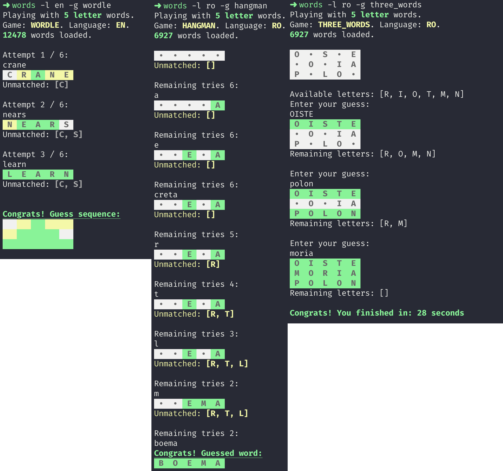

# Words
`Words` is a set of command line word-based puzzle games. Best way to spend those minutes within the CLI while your build is running ;).  

But `Words` is more than that. It has a set of built-in utilities which can help get better at games: you can check solution candidates based on regexes, 
get word definitions or even learn random words each day.

<p  align="center">
  
</p>

# Install
Download the native binary for your platform from the releases page: [https://github.com/ludovicianul/words/releases](https://github.com/ludovicianul/words/releases).

You can also add `words` to PATH so that you have it available at any time. Example for macOS:

```shell
> cp words-macos /usr/local/bin/words
```

# Playing a game
`Words` has (currently) 4 built-in games: Wordle, Hangman, Three_Words and Jotto. Each of these games have 3 built-in dictionaries: English, Romanian and Romanian extended. 
The games can be played with words length between 4 and 15.

```shell
words -w [letters] -l [language] -d [user_dictionary] -g [game]
```

When no params are provided, the default is: Wordle with 5-letter words and the built-in English dictionary.

## Examples:

This will run Wordle with 5-letter Romanian words.

```shell
> words -w 5 -l ro
```

This will run Hangman with 6-letter English words.

```shell
> words -w 6 -l en -g hangman
```

This will run Wordle with 6-letter words and a user supplied dictionary.

```shell
> words -w 6 -d /Users/word/dictionary.txt
```

# Playing Wordle
Based on Wordle gameplay: [https://en.wikipedia.org/wiki/Wordle](https://en.wikipedia.org/wiki/Wordle).

# Playing Hangman
Based on Hangman gameplay: [https://en.wikipedia.org/wiki/Hangman_(game)](https://en.wikipedia.org/wiki/Hangman_(game))

# Playing Three_Words
For this one you are given 3 words. From each word a number of letters have been removed (we call these words obfuscated) and added to a single shuffled set (available letters).
The objective is to reconstruct those initial 3 words. The game accepts any combination that can be made using the obfuscated words and available letters.

# Playing Jotto
Based on Jotto gameplay: [http://www.panix.com/~sos/bc/jotto.html](http://www.panix.com/~sos/bc/jotto.html)

# Dictionaries
English dictionary used: [https://www.wordgamedictionary.com/sowpods/download/sowpods.txt](https://www.wordgamedictionary.com/sowpods/download/sowpods.txt).

Romanian dictionary used: [https://dexonline.ro/scrabble](https://dexonline.ro/scrabble).

# Additional commands

```shell
Usage: words [-hV] [-d=<dictionary>] [-g=<game>] [-l=<language>] [-r=<lettersRmoved>] [-w=<wordSize>] [COMMAND]
  -d, --dictionary=<dictionary>
                      User provided dictionary
  -g, --game=<game>   The game to play. Default: WORDLE
  -h, --help          Show this help message and exit.
  -l, --language=<language>
                      Language of the dictionary to be used. Default: EN
  -r, --lettersRemoved=<lettersRmoved>
                      The number of letters to remove. Has effect only when playing THREE_WORDS. Default: 2
  -V, --version       Print version information and exit.
  -w, --word-size=<wordSize>
                      The size of the selected words. Default: 5
Commands:
  generate-completion  Generate bash/zsh completion script for words.
  help                 Displays help information about the specified command
  stats                Display high scores for each game
  games                Display available games
  dictionaries         Display builtin dictionaries and number of words
  check                Check if the given word is valid or display a list of words matching given regex
  def                  Display the definition of the given word

```

## Examples

Check all possible 5-length words starting with `s` and ending with `t` for English.
    
```shell
words check -l en -r "s...w"

The following words are matching the given regex: [sprew, squaw, strew, straw, strow, scraw, screw, scrow, serow, sybow, shrew, shrow, sinew]
```

Get a new random word definition for Romanian.

```shell
words def -r -l ro

 nostimada - NOSTIMÁDĂ, nostimade, s. f. Lucru, întâmplare, glumă etc. plină de haz sau caraghioasă. * Loc. adj. De toată nostimada = foarte nostim, plin de haz. - Din ngr. nostimádha. >> https://dexonline.ro/definitie/nostimada

```

